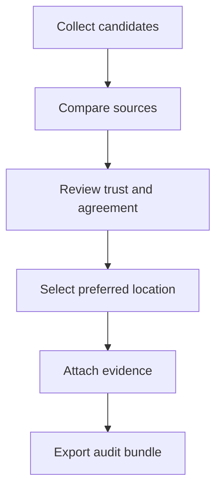

# GeoClick Capture

**GeoClick Capture 2.0.1** is a QGIS plugin for finding, comparing, verifying, reviewing and recording auditable place locations.

- QGIS 3.28+ and QGIS 4 / Qt 6
- Windows, Linux and macOS
- No external Python dependencies
- MIT licensed

## Why GeoClick Capture?

Location verification often requires comparing online search results, institutional gazetteers, existing project layers and field evidence. GeoClick Capture brings those sources into one workspace while keeping the final decision with the user and preserving an auditable record.

## Verification workflow



## Location Verification Workspace

The sixth tab combines:

- online Nominatim results and supported map URLs;
- institutional CSV or QGIS-layer gazetteers;
- nearby existing features from **Match & Verify**;
- manual coordinates;
- selected QGIS point, line or polygon features, using the geometry point or centroid while preserving the original geometry type.

The workspace calculates transparent source-trust, spatial-agreement and recommendation scores. It reports the maximum distance between sources and classifies consensus as **Strong**, **Moderate**, **Weak**, **Divergent** or **Single source**. Recommendations remain advisory: the user explicitly chooses the preferred source.

## Evidence and verification bundles

Users can attach local files or URLs. Files are hashed with SHA-256. **Export bundle** creates:

```text
workspace.json
report.html
candidates.csv
evidence.csv
manifest.json
attachments/
```

The workspace persists inside the QGIS project and can be exchanged through JSON or ZIP files. Candidate lists can be imported from CSV using the packaged template:

`qgis_latlon/samples/workspace_candidates_template.csv`

## Auditable output

Saving the preferred candidate to the session records the workspace ID, preferred source, source count, candidate count, maximum spread, consensus, agreement, evidence manifest, rationale, verifier, UTC timestamp, geometry evidence types and complete workspace snapshot. Verified and rejected workspaces also update Review Queue history.

## Available workflows

1. **Capture Log** — map-click capture, snapping, sessions and export.
2. **Search & Capture** — place/address search, coordinates and map URLs.
3. **Match & Verify** — nearby-feature comparison and duplicate-risk evidence.
4. **Offline Gazetteer** — names, aliases and P-codes without Internet.
5. **Review Queue** — approvals, rejections, change requests and immutable history.
6. **Verification Workspace** — multi-source comparison, evidence and complete reports.

## Typical applications

GeoClick Capture can support humanitarian GIS, cadastral mapping, infrastructure and telecommunications projects, health-facility and census data management, project monitoring and OpenStreetMap quality assurance.

## Installation

### Official QGIS repository

Open **QGIS → Plugins → Manage and Install Plugins**, search for **GeoClick Capture**, and select **Install Plugin**.

### Install from ZIP

1. Download `geoclick_capture-2.0.1.zip`.
2. Open **QGIS → Plugins → Manage and Install Plugins → Install from ZIP**.
3. Select the downloaded archive, then restart or reload the plugin if replacing an earlier version.

## Compatibility

- QGIS 3.28 or later
- QGIS 4.x / Qt 6
- Windows, Linux and macOS
- No external Python dependencies

## Feedback and support

Community feedback is welcome:

- [Report a bug](https://github.com/Jubilio/qgis-latlon/issues/new?template=bug_report.yml)
- [Request a feature](https://github.com/Jubilio/qgis-latlon/issues/new?template=feature_request.yml)
- [Browse existing issues](https://github.com/Jubilio/qgis-latlon/issues)
- [View the QGIS plugin page](https://plugins.qgis.org/plugins/qgis_latlon/)

Please do not include sensitive operational data, personal information or confidential evidence in public issues.

## Development

```bash
python -m compileall -q qgis_latlon
python -m unittest discover -s tests -v
```

See the packaged [README](qgis_latlon/README.md), [CHANGELOG](CHANGELOG.md), [citation metadata](CITATION.cff) and [LICENSE](LICENSE).

## Citation

If GeoClick Capture supports your work, please cite the software using the metadata in [CITATION.cff](CITATION.cff). A DOI can be added in a future archived release.

## Licence

MIT License.
